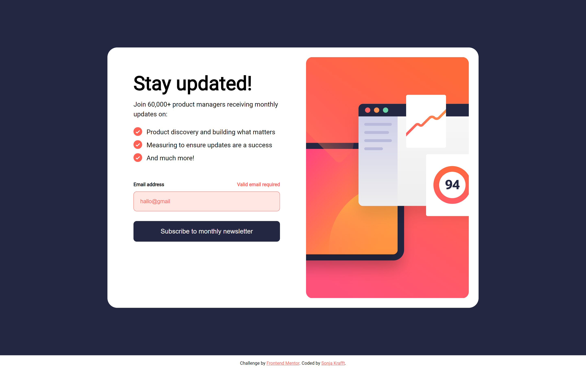
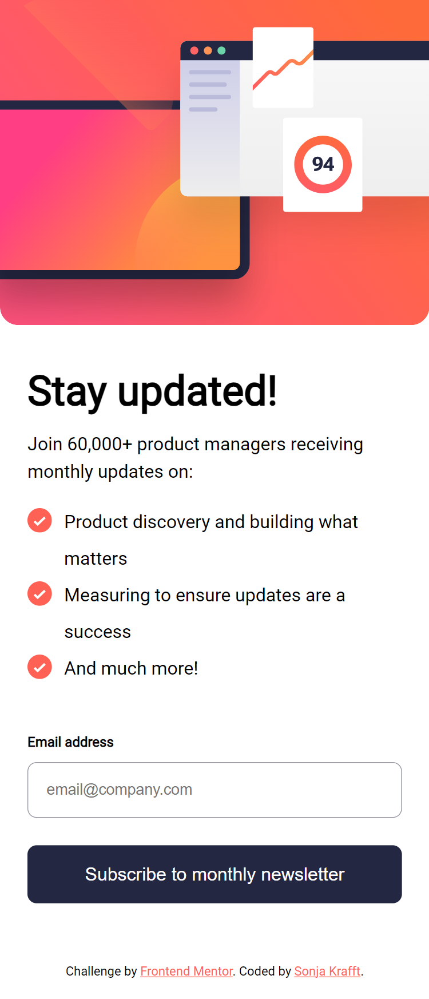
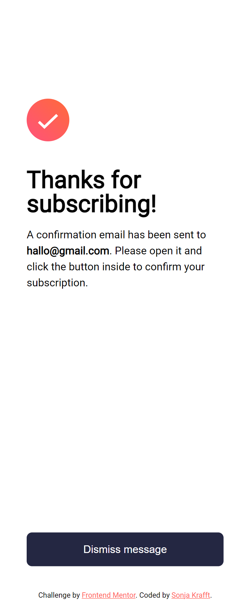

# Frontend Mentor - Newsletter sign-up form with success message solution

This is a solution to the [Newsletter sign-up form with success message challenge on Frontend Mentor](https://www.frontendmentor.io/challenges/newsletter-signup-form-with-success-message-3FC1AZbNrv). Frontend Mentor challenges help you improve your coding skills by building realistic projects. 

## Table of contents

- [Overview](#overview)
  - [The challenge](#the-challenge)
  - [Screenshot](#screenshot)
- [My process](#my-process)
  - [Built with](#built-with)
  - [What I learned](#what-i-learned)
  - [Continued development](#continued-development)
- [Author](#author)

**Note: Delete this note and update the table of contents based on what sections you keep.**

## Overview

### The challenge

Users should be able to:

- Add their email and submit the form
- See a success message with their email after successfully submitting the form
- See form validation messages if:
  - The field is left empty
  - The email address is not formatted correctly
- View the optimal layout for the interface depending on their device's screen size
- See hover and focus states for all interactive elements on the page

### Screenshot






## My process

### Built with

- HTML, SCSS, JS
- Mobile-first workflow
- Webstorm with Simple Hot Reload Server (install: `npm install -g simple-hot-reload-server`, start: `hrs`) and File Watcher with SCSS for building CSS

### What I learned

Use this section to recap over some of your major learnings while working through this project. Writing these out and providing code samples of areas you want to highlight is a great way to reinforce your own knowledge.

To see how you can add code snippets, see below:

```html
 <form id="form" novalidate>
  <div class="input_field">
    <div class="input_labels">
      <label for="address">Email address</label>
      <span aria-live="polite" id="address-error" class="error-message">Valid email required</span>
    </div>
    <input id="address" name="address" placeholder="email@company.com"/>
  </div>

  <button id="submitBtn">Subscribe to monthly newsletter</button>
</form>
```
- Error and Error Messages
```css
.error {
  border-color: $tomato;
  outline-color: $tomato;
  background-color: #FFE8E4;
  color: $tomato;

  &:-webkit-autofill,
  &:-webkit-autofill:hover,
  &:-webkit-autofill:focus {
    -webkit-text-fill-color: $tomato;
    -webkit-box-shadow: 0 0 0px 40rem #FFE8E4 inset;
  }
}

.error-message {
  color: $tomato;
  display: none;
  text-align: right
}
```
- Get Form Data
```js
form.addEventListener('submit', function (e) {
  e.preventDefault();
  const formData = new FormData(e.target);
  const data = Object.fromEntries(formData);
  const address = data.address.toString();
});
 ```
- Reset Form
```js
form.reset();
```
- Data Validation
```js
const emailRegex =  /^[^\s@]+@[^\s@]+\.[^\s@]+$/;
if (!emailRegex.test(address)) {}
```
- Change Text with JS
```js
email.innerText = address;
```


If you want more help with writing markdown, we'd recommend checking out [The Markdown Guide](https://www.markdownguide.org/) to learn more.

**Note: Delete this note and the content within this section and replace with your own learnings.**

### Continued development

The Error State seems to be cheated.


## Author

- Github - [Sonja Krafft](https://www.github.com/sonmikrafft)
- Frontend Mentor - [@sonmikrafft](https://www.frontendmentor.io/profile/sonmikrafft)
